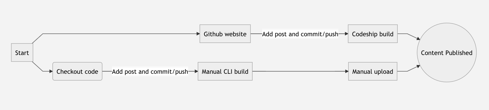
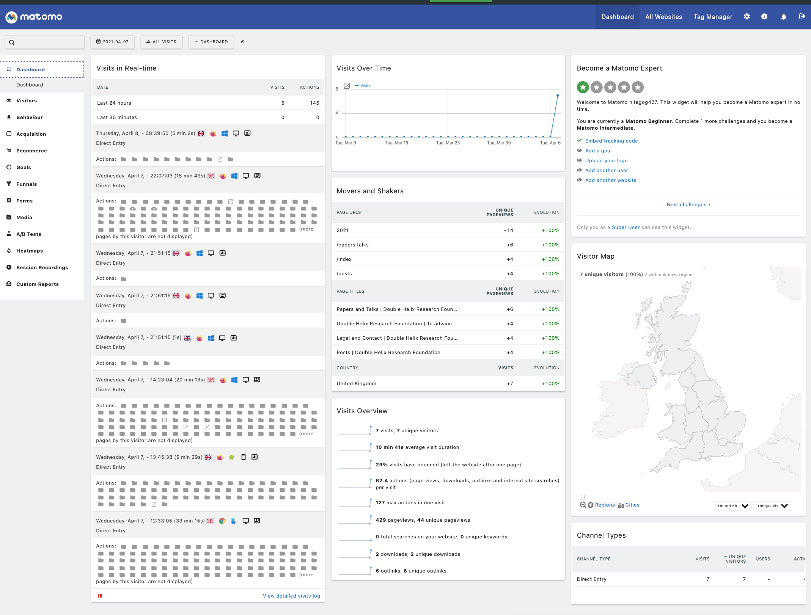
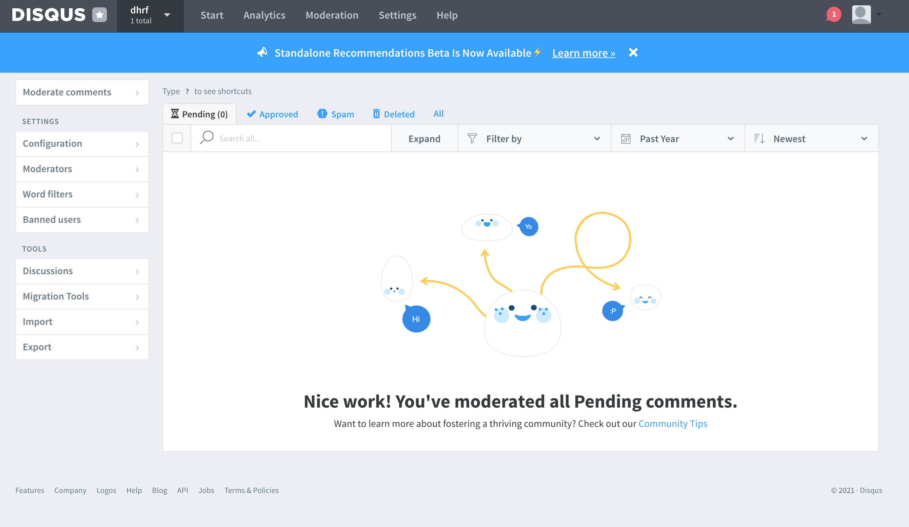

# bayesai.io
Website for bayesai.io 

BayesAI is a Jekyll based static site that hosts a blog and papers.

## Installation

### Windows

#### Installing Ruby and Jekyll
##### Installation via RubyInstaller
The easiest way to install Ruby and Jekyll is by using the [RubyInstaller](https://rubyinstaller.org/) for Windows.

1.  Download and install a  Ruby+Devkit v2.7 from  [RubyInstaller](https://rubyinstaller.org/downloads/) or **[Direct Link](https://github.com/oneclick/rubyinstaller2/releases/download/RubyInstaller-2.7.2-1/rubyinstaller-devkit-2.7.2-1-x64.exe)**. Use default options for installation.
2.  Run the  `ridk install`  step on the last stage of the installation wizard. This is needed for installing gems with native extensions. See the  [RubyInstaller Documentation](https://github.com/oneclick/rubyinstaller2#using-the-installer-on-a-target-system)
3.  Open a new command prompt window from the start menu, so that changes to the  `PATH`  environment variable becomes effective. Install Jekyll and Bundler using  
`gem install jekyll bundler`
5.  Check if Jekyll has been installed properly:  `jekyll -v`

### Mac
Use brew or rvm to install an appropriate version of ruby and install dependencies
```
brew install ruby@2.7
export PATH="/usr/local/lib/ruby/gems/2.7.0/bin:/usr/local/Cellar/ruby@2.7/2.7.3/bin:$PATH" >> ~/.bash_profile
source ~/.bash_profile
```

## Usage

Project setup
```
git checkout git@github.com:bayesai/bayesai.git
cd bayesai.io
bundle
```

### Serving the project on [http://localhost:4000](http://localhost:4000)
```
JEKYLL_ENV=production jekyll serve
```

### Regenerate the html for publishing
```
JEKYLL_ENV=production jekyll clean
JEKYLL_ENV=production jekyll build
```

## Adding new content
There are two ways that content can be added to the site, via githubs website and editing locally


### Github website

[Codeship CI project link](https://app.codeship.com/projects/441335)

### Manual
For the manual method please follow these commands (after checking out the project)
```
JEKYLL_ENV=production jekyll build

npm i -g surge
surge _site
```

## Analtics

There is an analytics dashboard available at [Mamoto](https://bayesai.matomo.cloud/index.php?module=CoreHome&action=index&idSite=1&period=day&date=yesterday#?idSite=1&period=day&date=yesterday&segment=&category=General_Visitors&subcategory=General_RealTime)



## Comments

There is a comment feature provided by disqus where comments can be moderated [Disqus](https://bayesai.disqus.com/admin/moderate/pending)


